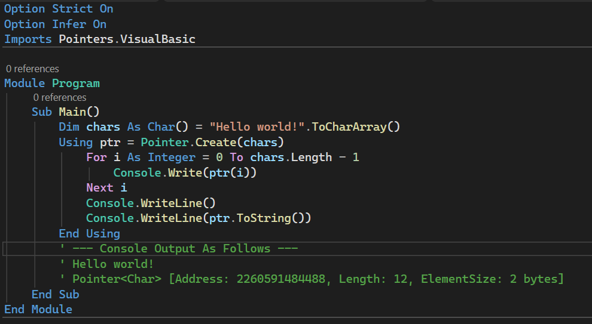

# `Pointers.VisualBasic` - A VB.NET Library for Memory-Safe Pointer Operations



## Description
This class library provides **memory-safe pointer operations** for VB.NET, designed to enhance VB.NET's memory management capabilities while enabling secure access to unmanaged memory. Under the hood, it implements low-level memory operations, making full use of C#'s `unsafe` context, which allows VB.NET developers to perform pointer-related development safely and efficiently, without directly using raw pointers that are not natively supported in VB.NET.

## Core Features
### `Pointer(Of T)` Generic Class
- Type-safe pointer operations to avoid memory errors caused by type mismatches
- Memory access with built-in bounds checking to eliminate out-of-range access risks
- Rich set of pointer manipulation methods (offset, copy, fill, etc.)
- Implements the `IDisposable` interface to ensure proper resource release

### `MemoryBlock` Class
- Safe allocation and deallocation of unmanaged memory
- Unified management of type-agnostic memory blocks
- Convenient conversion to strongly-typed `Pointer(Of T)` instances
- Built-in finalizer protection for automatic cleanup of unmanaged memory that isn't manually released

### `Pointer` Factory Class
- Fluent API for creating typed pointers from arrays
- Utility functions for pointer operations like retrieving the upper bound index

## Installation & Build
### 1. Obtain Source Code
Clone the repository and navigate to the project directory:
```bash
git clone https://github.com/Pac-Dessert1436/Pointers.VisualBasic.git
cd Pointers.VisualBasic
```

### 2. Build the Project
You can build the project using Visual Studio or the .NET CLI:
```bash
dotnet build
```

### 3. Integrate into VB.NET Projects
Reference the built `Pointers.VisualBasic.dll` in your VB.NET project, or add the class library project directly via project references.

## Usage Examples
### Example 1: Basic Usage of `Pointer(Of T)`
Create a typed pointer from an array and perform element access, offset, copy, and other operations:
```vb
Imports Pointers.VisualBasic

Module Program
    Sub Main()
        ' Initialize array and create pointer (Using statement ensures automatic resource release)
        Dim sourceArray As Integer() = {1, 2, 3, 4, 5}
        Using ptr As Pointer(Of Integer) = Pointer.Create(sourceArray)
            ' Access/modify elements pointed to by the pointer
            Dim first As Integer = ptr(0) ' Read the first element
            Console.WriteLine("First Element: " & first)
            Console.WriteLine("Second Element: " & ptr(1))
            ptr(1) = 10 ' Modify the second element to 10
            
            ' Output basic pointer information
            Console.WriteLine("Pointer Info: " & ptr.ToString())
            Console.WriteLine("Memory Address: 0x" & ptr.Address.ToString("X")) ' Hexadecimal address
            Console.WriteLine("Total Elements: " & ptr.Length)
            Console.WriteLine("Element Byte Size: " & ptr.ElementSize)
            
            ' Create an offset pointer (offset by 2 elements)
            Using offsetPtr As Pointer(Of Integer) = ptr.Offset(2)
                Console.WriteLine("Offset Pointer Total Elements: " & offsetPtr.Length)
                Console.WriteLine("Offset Pointer First Element: " & offsetPtr(0)) ' Third element of the original array
            End Using
            
            ' Copy pointer content to a new array
            Dim destArray(4) As Integer
            ptr.CopyTo(destArray)
            
            ' Convert pointer content to a new array
            Dim copiedArray As Integer() = ptr.ToArray()
            
            ' Fill all elements with a specified value
            ptr.Fill(0)
        End Using ' Automatically calls Dispose to release pointer resources
    End Sub
End Module
```

### Example 2: Manage Unmanaged Memory with `MemoryBlock`
Allocate an unmanaged memory block, convert it to a typed pointer, and perform operations:
```vb
Imports Pointers.VisualBasic

Module Program
    Sub Main()
        ' Allocate an unmanaged memory block for 5 Integers
        Using memoryBlock = MemoryBlock.Allocate(Of Integer)(5)
            Console.WriteLine("Memory Block Info: " & memoryBlock.ToString())
            Console.WriteLine("Memory Block Total Bytes: " & memoryBlock.SizeInBytes)
            
            ' Convert the memory block to an Integer-type pointer
            Using intPtr As Pointer(Of Integer) = memoryBlock.AsPointer(Of Integer)(5)
                ' Assign values to each element
                For i As Integer = 0 To intPtr.Length - 1
                    intPtr(i) = i * 2
                Next i
                
                ' Iterate and read elements
                For i As Integer = 0 To intPtr.Length - 1
                    Console.WriteLine($"Element [{i}]: {intPtr(i)}")
                Next i
            End Using
            
            ' Fill all bytes of the memory block with 0
            memoryBlock.Fill(0)
        End Using ' Automatically releases unmanaged memory
    End Sub
End Module
```

### Example 3: Advanced Usage - Data Copy Between Pointers
Precisely copy a specified number of elements between two pointers:
```vb
Imports Pointers.VisualBasic

Module Program
    Sub Main()
        ' Initialize source and destination arrays
        Dim sourceArray As Integer() = {1, 2, 3, 4, 5}
        Dim destArray(4) As Integer ' Empty array with length 5

        ' Create source and destination pointers
        Using sourcePtr = Pointer.Create(sourceArray)
            Using destPtr = Pointer.Create(destArray)
                ' Copy all elements (sourcePtr -> destPtr)
                sourcePtr.CopyTo(destPtr)
                
                ' Copy only the first 3 elements
                sourcePtr.CopyTo(destPtr, 3)
            End Using
        End Using
        
        ' Verify copy result
        Console.WriteLine("Destination Array Content: " & String.Join(", ", destArray))
    End Sub
End Module
```

## API Reference
### `Pointer` Factory Class
| Function Signature | Description |
|------------------|-------------|
| `Shared Create(array As T())` | Creates a `Pointer(Of T)` instance from an array, internally pinning it to prevent garbage collector movement. Provides a more fluent alternative to the constructor |
| `Shared UBound(Of T)(ptr As Pointer(Of T))` | Gets the upper bound index of the pointer, which is one less than the total number of elements (equivalent to `ptr.Length - 1`) |

### Core Members of `Pointer(Of T)`
#### Properties
| Property Name | Description |
|---------------|-------------|
| `Length` | Gets the total number of elements pointed to by the pointer |
| `IsNull` | Indicates whether the pointer is null |
| `ElementSize` | Gets the byte size of a single element |
| `ElementType` | Gets the type of the elements (Type) |
| `Address` | Gets the memory address of the pointer (IntPtr) |

#### Methods
| Method Signature | Description |
|------------------|-------------|
| `Offset(offset As Integer)` | Creates a new pointer offset by the specified number of elements |
| `CopyTo(destination As Pointer(Of T), Optional count As Integer = 0)` | Copies elements to the target pointer (count=0 means all elements) |
| `CopyTo(destination As T(), Optional count As Integer = 0)` | Copies elements to the target array |
| `CopyFrom(source As T(), Optional count As Integer = 0)` | Copies elements from the source array to the pointer |
| `Fill(value As T)` | Fills all elements pointed to by the pointer with the specified value |
| `ToArray()` | Converts the pointer content to a new array |
| `Dispose()` | Releases resources occupied by the pointer (automatically called by Using) |

### Core Members of `MemoryBlock`
#### Properties
| Property Name | Description |
|---------------|-------------|
| `SizeInBytes` | Gets the total number of bytes of the memory block |
| `IsDisposed` | Indicates whether the memory block has been disposed |
| `Address` | Gets the starting address of the memory block |

#### Methods
| Method Signature | Description |
|------------------|-------------|
| `Shared Allocate(Of T)(elementCount As Integer)` | Allocates a memory block capable of holding the specified number of T-type elements |
| `AsPointer(Of T)(elementCount As Integer)` | Converts the memory block to a `Pointer(Of T)` instance |
| `Fill(value As Byte)` | Fills all bytes of the memory block with the specified byte value |
| `CopyTo(destination As MemoryBlock, Optional count As Integer = 0)` | Copies memory block data to the target memory block |
| `Dispose()` | Releases unmanaged memory (automatically called by Using) |

## Safety Guarantees
The library is designed to avoid common risks of raw pointers, with core safety features including:
1. **Bounds Checking**: All index operations validate legality and throw `ArgumentOutOfRangeException` on out-of-bounds access
2. **Null Pointer Checking**: Verifies pointer nullity before method execution to avoid null reference errors
3. **Disposed State Checking**: Throws `ObjectDisposedException` when operating on disposed objects
4. **Automatic Memory Management**: Dual protection via `IDisposable` and finalizers to prevent memory leaks
5. **Type Safety**: Generic parameters strictly enforce type constraints to avoid type-unsafe memory access

## Important Notes
1. Always wrap pointer/memory block instances in `Using` statements to ensure timely resource release (especially for unmanaged memory)
2. When `Pointer(Of T)` is created from an existing array, the array is automatically pinned to prevent memory invalidation caused by GC movement
3. `MemoryBlock` allocates unmanaged memory and must be manually disposed (or rely on `Using` for automatic disposal) to avoid memory leaks
4. No `unsafe` code is required at the VB.NET layer - all unsafe operations are encapsulated in the underlying C# implementation

## License
This project is licensed under the MIT License. For details, see the [LICENSE](LICENSE) file.